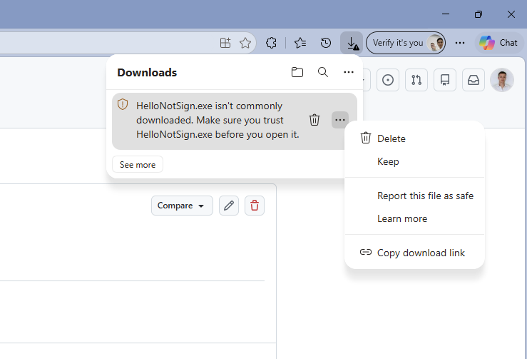
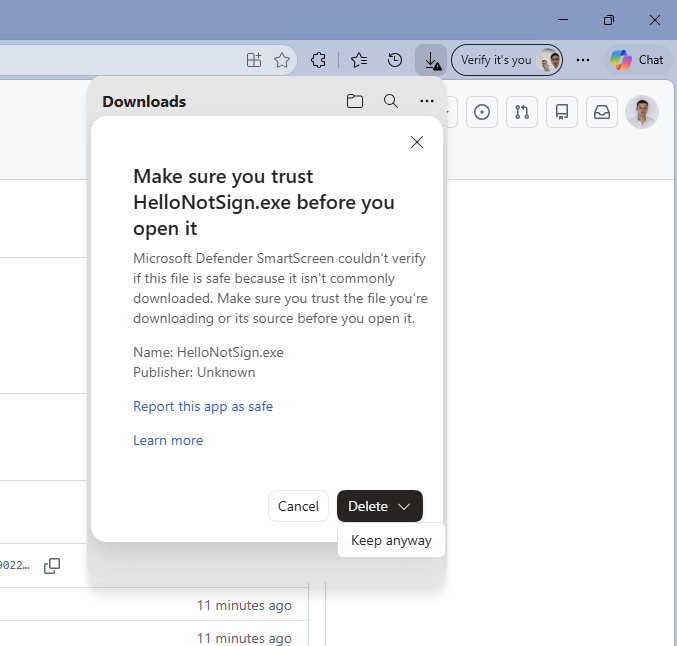
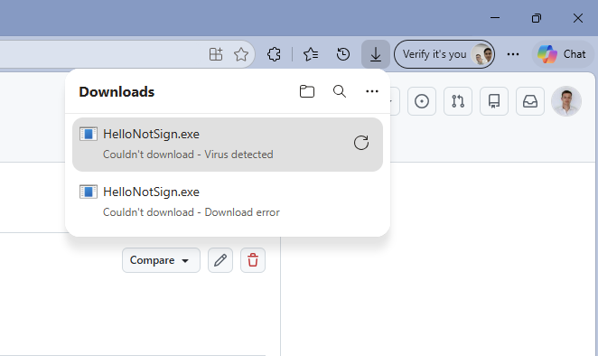
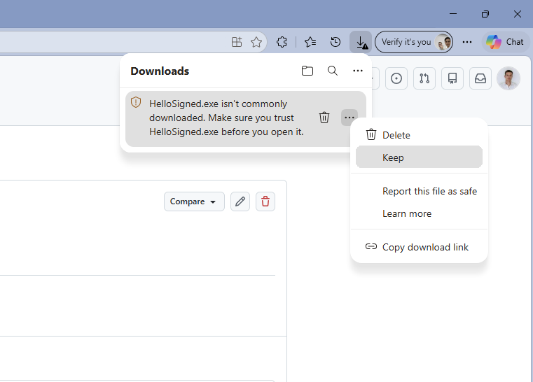
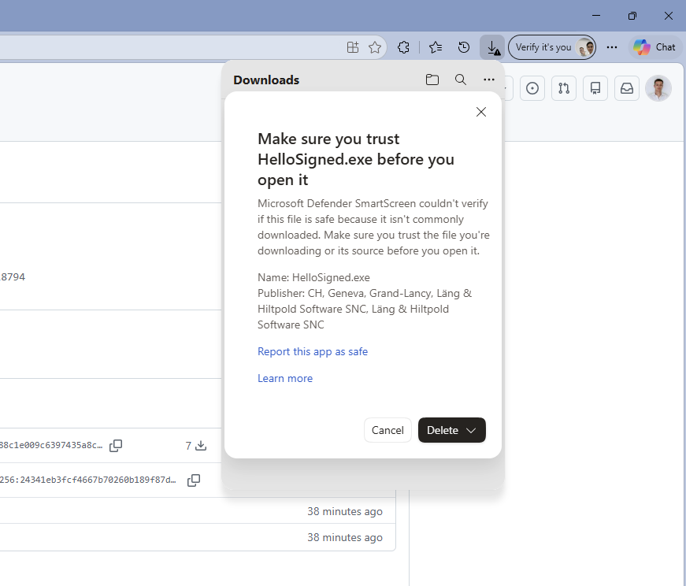

# Windows Code Signing Test

Petit projet pour tester la signature de code Windows avec **Microsoft Azure Artifact Signing** (anciennement Trusted Signing) et observer comment Windows (Edge, SmartScreen, Defender) réagit face à un exécutable signé ou non.

## Contenu

| Fichier | Rôle |
|---|---|
| `hello.c` | Programme de test : affiche une simple boîte de dialogue (`MessageBox`) |
| `compileAndSign.ps1` | Compile un fichier C avec GCC puis le signe avec Azure Artifact Signing |
| `metadata.json` | Configuration de la signature (endpoint, compte, profil de certificat) |
| `docs/images/` | Captures d'écran des tests |

Les `.exe` ne sont pas versionnés (`.gitignore`). Ils sont publiés dans les [Releases](../../releases) du dépôt.

## Compilation

Avec MinGW-w64 (GCC) :

```bash
gcc -O2 -mwindows -s hello.c -o HelloNotSign.exe
```

## Test 1 : exécutable non signé (`HelloNotSign.exe`)

L'exe a été publié dans une release GitHub, puis téléchargé avec Microsoft Edge pour reproduire un vrai téléchargement (le fichier reçoit alors le *Mark of the Web*). Le programme n'a même pas pu être lancé : Windows Defender le détecte comme un virus et le **supprime de l'ordinateur**.

### Ce qui se passe

**1. Edge avertit que le fichier est rare.**
Dès le téléchargement, Edge affiche « *HelloNotSign.exe isn't commonly downloaded. Make sure you trust HelloNotSign.exe before you open it.* ». Le menu propose *Delete*, *Keep*, *Report this file as safe*.



**2. SmartScreen ne peut pas vérifier le fichier.**
En cliquant sur l'avertissement, Microsoft Defender SmartScreen explique qu'il ne peut pas vérifier que le fichier est sûr car il est peu téléchargé. L'éditeur est affiché comme **« Publisher: Unknown »**. Le bouton par défaut est *Delete* ; il faut ouvrir le menu déroulant pour trouver *Keep anyway*.



**3. Defender détecte un virus et supprime le fichier : « Virus detected ».**
Après avoir choisi de conserver le fichier, Windows Defender l'analyse, annonce « *Couldn't download - Virus detected* » et **supprime le fichier du PC**. Le fichier n'est donc jamais disponible (un autre essai affiche simplement « *Download error* »).



### Pourquoi

- **Aucune signature** : sans certificat, Windows ne peut pas identifier l'éditeur (*Publisher: Unknown*).
- **Aucune réputation** : SmartScreen juge un fichier par sa réputation (nombre de téléchargements, éditeur connu). Un exe tout neuf n'en a aucune, d'où « isn't commonly downloaded ».
- **Détection antivirus** : un petit exécutable natif, non signé, inconnu et téléchargé depuis un hébergement public correspond à un profil que les heuristiques de Defender traitent comme suspect. Le message « Virus detected » est ici un **faux positif** : le code source (`hello.c`) ne fait qu'afficher une boîte de dialogue.

Ces trois éléments s'additionnent : SmartScreen est un avertissement que l'utilisateur peut contourner, mais l'analyse antivirus, elle, détecte le fichier comme malveillant et le supprime.

## Signature avec Azure Artifact Signing

Prérequis (installés en local, hors dépôt) :

- `signtool.exe` du Windows SDK ;
- le plugin `Azure.CodeSigning.Dlib` (paquet NuGet `Microsoft.ArtifactSigning.Client`, extrait dans `tools/`, ignoré par git) ;
- le **runtime .NET 8** : sans lui, `signtool` échoue sans message d'erreur ;
- Azure CLI, avec `az login` fait sur un compte ayant le rôle *Artifact Signing Certificate Profile Signer* ;
- un compte et un profil de certificat Artifact Signing validés, renseignés dans `metadata.json`.

Compiler et signer :

```powershell
.\compileAndSign.ps1 hello.c -o HelloSigned.exe
```

Le script compile, signe (avec horodatage Microsoft), puis vérifie la signature avec `signtool verify`.

Le certificat est à courte durée de vie (quelques jours). La signature reste valide après son expiration grâce à l'horodatage.

## Test 2 : exécutable signé (`HelloSigned.exe`)

Même programme, signé, publié dans une release GitHub puis téléchargé avec Edge de la même façon.

### Ce qui se passe

**1. Edge avertit toujours que le fichier est rare.**
Le message « *HelloSigned.exe isn't commonly downloaded* » s'affiche encore : il faut passer par le menu `...` et choisir *Keep* pour conserver le fichier.



**2. SmartScreen affiche maintenant l'éditeur.**
SmartScreen dit toujours qu'il ne peut pas vérifier le fichier car il est peu téléchargé, mais le champ *Publisher* n'est plus « Unknown » : il affiche l'identité validée du certificat (Läng & Hiltpold Software SNC, Genève, CH).



**3. Plus de « Virus detected », et plus aucun avertissement au lancement.**
Une fois conservé via *Keep*, le fichier reste sur le PC et **se lance sans problème : aucun écran SmartScreen, aucun message**. La version non signée, elle, était supprimée par Defender.

## Comparaison

| | Non signé | Signé |
|---|---|---|
| Avertissement « isn't commonly downloaded » | Oui | Oui |
| Éditeur affiché par SmartScreen | Unknown | Identité validée du certificat |
| Détection par Defender | « Virus detected », fichier supprimé du PC | Aucune détection |
| Téléchargement | Impossible (fichier supprimé) | Possible après *Keep* |
| Lancement | Impossible | Direct, sans SmartScreen ni message |

## Conclusion

La signature ne supprime pas tout de suite l'avertissement SmartScreen : celui-ci repose aussi sur la **réputation** du fichier, qui se construit avec le nombre de téléchargements. En revanche elle change l'essentiel :

- l'éditeur est identifié au lieu d'être « Unknown » ;
- l'antivirus ne supprime plus le fichier comme menace ;
- l'utilisateur peut conserver l'exécutable et le lancer directement, sans écran SmartScreen au lancement.
